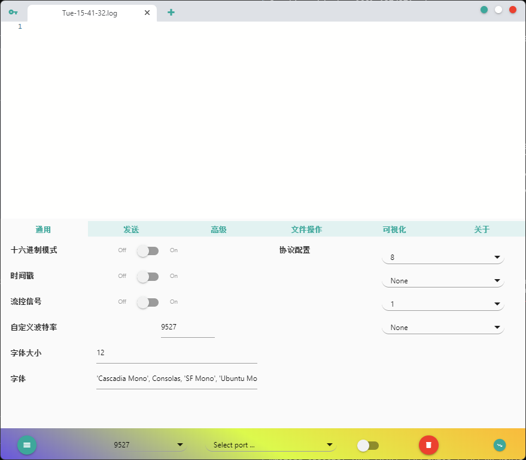

# comNG -- 现代化串口助手

> 距离上次发布已经 4 年有余， Gitee 上有 450 多个 star，[github](https://github.com/xenkuo/comNG) 上也有 60 多个 star，非常感谢大家的认可。
>
> 工作中我一直在使用 comNG，也收到了很多用户的反馈，是时候再更新一波了。
> 
> 主要计划以下更新：
>
> 1. 代码模块化重构、功能修复和优化。
> 2. 发布一款与 comNG 匹配的无线串口硬件。
> 3. 搭建用户社区。

## 介绍

comNG 区别于其他串口助手的地方在于其强大的 “现场数据分析“ 能力。简单来说就是 comNG 提供的多种功能以帮助用户更方便的分析打印输出文本。这些功能包括：

- 现代高效的 UI 和交互设计
- 支持多标签，多实例
- 专业的 Hex 模式
- 通用的数据图形化界面
- 自动文本高亮（基于内建的 comNGLang 语法）
- 手动文本高亮：类似于 notepad++ 的 Style Token
- 搜索文本高亮：类似于 vscode 的搜索文本高亮
- 选择文本高亮：类似于 vscode 的选择文本高亮
- 支持 minimap 功能：类似于 vscode 的 minimap
- 基于文本内容的中断功能：收到特定数据后自动关闭串口。
- 日志文档的签名：时间和姓名
- 常用命令支持快捷键操作，比如打开/关闭串口、打开/保存文件、清除文本、高亮文本等
- 跨平台：Windows， Mac OS 以及 基于 Debian 的 Linux 系统，比如 Ubuntu 和 Deepin
- 自定义主题（只支持软件下方 Bar 的背景色。）

另外还包含一些串口助手通用的功能：

- Modem 信号指示和控制
- 自动串口枚举
- 自定义波特率
- 十六进制接收/发送
- 接收时间戳
- 发送文本
- 流控
- 文件保存和打开，支持拖动
- 抓取至文件

请参考 [comNG 完整文档](doc/Introduction.md)， for English version please go to [comNG Introduction](doc/Introduction-en.md)。

## Screenshot

## 使用方法

下载对应系统的安装文件，安装，然后就可以正常使用了。

> 对于 Linux 系统，可能需要对串口设备文件执行以下命令： 
>
>`sudo chmod 666 /dev/ttyS1`，记得把 `ttyS1` 替换为你的串口设备文件。

### 加入用户群

添加下面的微信入群。在这里大家会一起讨论新功能，新 idea。

### 快捷键列表

- 打开文件： `CmdOrCtrl + O`
- 用 Hex 模式打开文件： `CmdOrCtrl + Shift + O`
- 保存文件： `CmdOrCtrl + S`
- 打开关闭串口：`CmdOrCtrl + D`
- 打开关闭串口，并且清空 Log：`CmdOrCtrl + Shift + D`
- 清空 Log：`CmdOrCtrl + X`
- 清空所有高亮：`CmdOrCtrl + Shift + X`
- 高亮/去高亮鼠标下方或选择的文本：`CmdOrCtrl + E`

## 开发

参考 [开发 / Development](./doc/Development.md)

## License

comNG 使用 MIT 授权。
comNG is [MIT](./LICENSE) licensed.
