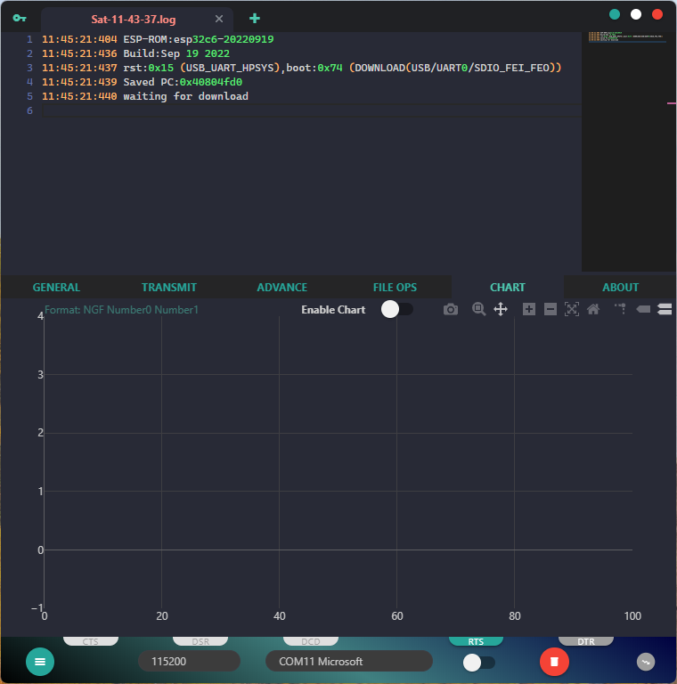
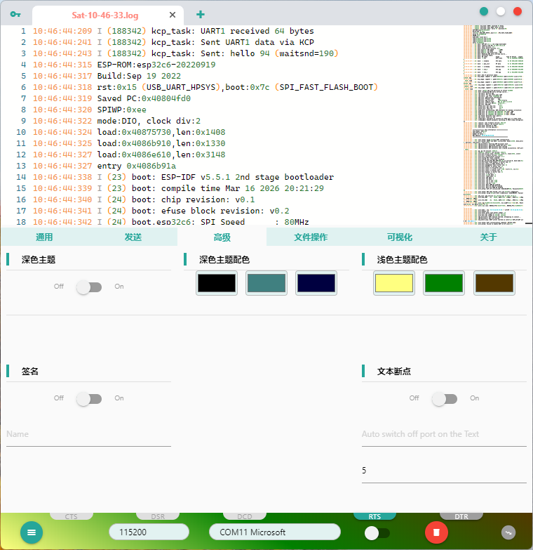
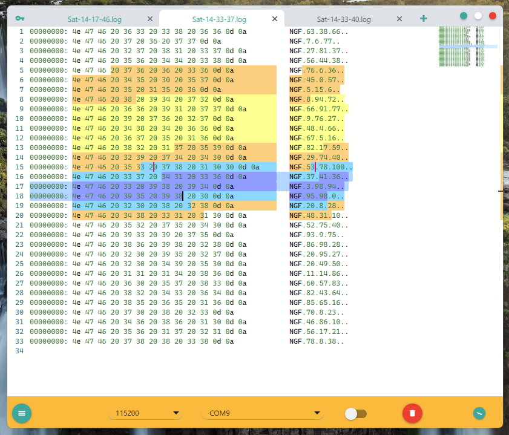
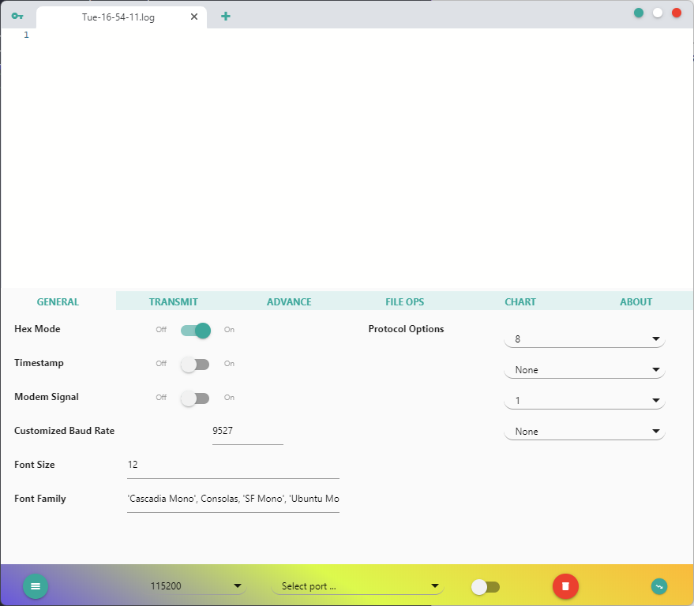

# comNG -- 现代的，优雅的串口工具

## 介绍

comNG 是一个现代的，优雅的串口工具，基于 Electron 开发。comNG 的目标用户是需要分析串口数据的工程师和开发者。comNG 的核心功能是提供强大的 “现场数据分析“ 能力，帮助用户更方便的分析打印输出文本。

其主要特点有：

- 现代高效的 UI 和交互设计
- 支持多标签，多实例
- 专业的 Hex 模式
- 通用的数据图形化界面
- 自动文本高亮（基于内建的 comNGLang 语法）
- 手动高亮任意文本
- 搜索文本高亮：同 vscode 的搜索文本高亮
- 选择文本高亮：同 vscode 的选择文本高亮
- 支持 minimap 同 vscode 的 minimap
- 基于文本内容的中断功能：收到特定数据后可自动关闭串口。
- 日志文档的签名：时间和姓名
- 快捷键操作：包括打开/关闭串口、打开/保存文件、清除文本、高亮文本等
- 跨平台：Windows， Mac OS 以及 基于 Debian 的 Linux 系统，比如 Ubuntu 和 Deepin
- 自定义主题（只支持软件下方 Bar 的背景色。）

另外还包含一些串口助手通用的功能：

- Modem 信号指示和控制
- 自动串口枚举
- 自定义波特率
- 十六进制接收/发送
- 接收时间戳
- 发送文本
- 流控
- 文件保存和打开，支持拖动
- 抓取至文件

更多细节请参考 [comNG 完整文档](doc/Introduction.md)。

For more details please refer to [comNG Introduction](doc/Introduction-en.md)。

## Screenshot

## 使用方法

下载对应系统的安装文件，安装，然后就可以正常使用了。

> * 新版本先在 Windows 发布，Linux 和 Mac OS 版本会在后续发布。
> * 对于 Linux 系统，可能需要对串口设备文件执行以下命令： 
>
>       `sudo chmod 666 /dev/ttyS1`
>   记得把 `ttyS1` 替换为你的串口设备文件。

### 加入用户群

添加下面的微信入群。在这里大家会一起讨论新功能，新 idea。

   
  

### 快捷键列表

- 打开文件： `CmdOrCtrl + O`
- 用 Hex 模式打开文件： `CmdOrCtrl + Shift + O`
- 保存文件： `CmdOrCtrl + S`
- 打开关闭串口：`CmdOrCtrl + D`
- 打开关闭串口，并且清空 Log：`CmdOrCtrl + Shift + D`
- 清空 Log：`CmdOrCtrl + X`
- 清空所有高亮：`CmdOrCtrl + Shift + X`
- 高亮/去高亮鼠标下方或选择的文本：`CmdOrCtrl + E`

## 开发

参考 [开发 / Development](./doc/Development.md)

## 更多截图

## License

comNG 使用 MIT 授权。

comNG is [MIT](./LICENSE) licensed.
