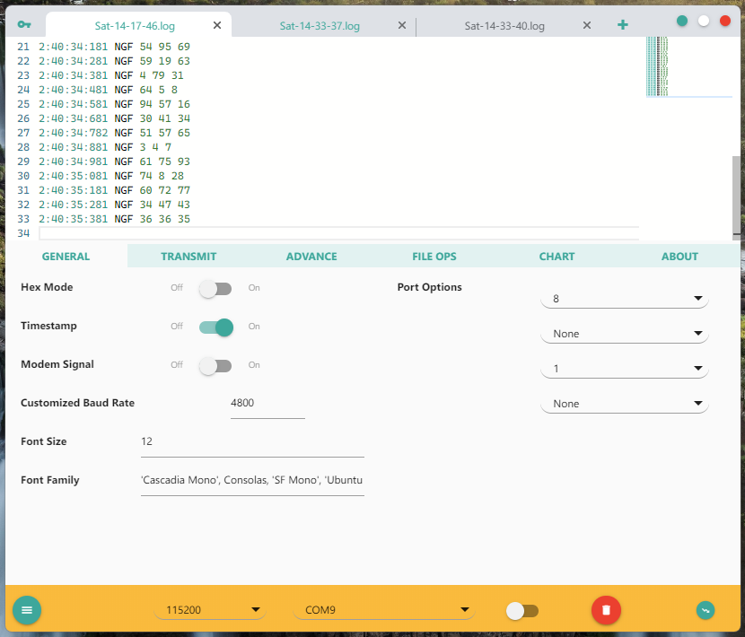

# comNG -- 现代化串口助手

> 距离上次发布已经 4 年有余， Gitee 上有 450 多个 star，github 上也有 60 多个 star，非常感谢大家的认可。
>
> 工作中我一直在使用 comNG，也收到了很多用户的反馈，是时候再更新一波了。
> 
> 主要计划以下更新：
>
> 1. 代码模块化重构、功能修复和优化。
> 2. 发布一款与 comNG 匹配的无线串口硬件。
> 3. 搭建用户社区。

## 介绍

comNG 区别于其他串口助手的地方在于其强大的 “现场数据分析“ 能力。简单来说就是 comNG 提供的多种功能以帮助用户更方便的分析打印输出文本。这些功能包括：

- 现代高效的 UI 和交互设计
- 支持多标签，多实例
- 专业的 Hex 模式
- 通用的数据图形化界面
- 自动文本高亮（基于内建的 comNGLang 语法）
- 手动文本高亮：类似于 notepad++ 的 Style Token
- 搜索文本高亮：类似于 vscode 的搜索文本高亮
- 选择文本高亮：类似于 vscode 的选择文本高亮
- 支持 minimap 功能：类似于 vscode 的 minimap
- 基于文本内容的中断功能：收到特定数据后自动关闭串口。
- 日志文档的签名：时间和姓名
  - TODO: 日志保存后加密。
- 常用命令支持快捷键操作，比如打开/关闭串口、打开/保存文件、清除文本、高亮文本等
- 跨平台：Windows， Mac OS 以及 基于 Debian 的 Linux 系统，比如 Ubuntu 和 Deepin
- 自定义主题（只支持软件下方 Bar 的背景色。）

另外还包含一些串口助手通用的功能：

- Modem 信号指示和控制
- 自动串口枚举
- 自定义波特率
- 十六进制接收/发送
- 接收时间戳
- 发送文本
- 流控
- 文件保存和打开，支持拖动
- 抓取至文件

请参考 [comNG 完整文档](doc/Introduction.md)， for English version please refer to [comNG Introduction](doc/Introduction-en.md)。

## Screenshot




## 使用方法

下载对应系统的安装文件，安装，然后就可以正常使用了。对于 Linux 系统，可能需要对串口设备文件执行以下命令：

`sudo chmod 666 /dev/ttyS1`

记得把 `ttyS1` 替换为你的串口设备文件。

### 快捷键列表

- 打开文件： `CmdOrCtrl + O`
- 用 Hex 模式打开文件： `CmdOrCtrl + Shift + O`
- 保存文件： `CmdOrCtrl + S`
- 打开关闭串口：`CmdOrCtrl + D`
- 打开关闭串口，并且清空 Log：`CmdOrCtrl + Shift + D`
- 清空 Log：`CmdOrCtrl + X`
- 清空所有高亮：`CmdOrCtrl + Shift + X`
- 高亮/去高亮鼠标下方或选择的文本：`CmdOrCtrl + E`

## 开发

### 克隆代码

```ps
git clone git@gitee.com:xenkuo/comNG.git
```

### 设置开发环境

> python 版本

node-gyp 和 comNG 里的模块都依赖 python。node-gyp 安装时如果发现环境变量里没有 path 会自动安装最新版本 python，目前是 3.12.x。

这个版本太新，和 comNG 里的模块有冲突。目前已知的兼容版本是 python v3.10.9， 可以在 [HuaWei Mirros](https://mirrors.huaweicloud.com/python/) 下载。

安装时一定记得 **添加 python 到环境变量**。

> node & yarn 安装

先安装 node，测试过的最新版本是 v16.20.2 LTS。comNG 需要编译 native module，也就是 node-gyp，所以下图选项需要勾选：


Yarn 是使用的 Yarn 1， Yarn 2+没有测试过。安装命令如下：

```ps
npm install --global yarn
```

> 网络问题

如果网络有问题，建议使用以下 `.npmrc` 文件配置：

```ps
registry=https://registry.npm.taobao.org
electron_mirror=https://cdn.npm.taobao.org/dist/electron/
electron_custom_dir=7.2.4
```

> 已知问题

- yarn Error: certificate has expired
  - `yarn config set "strict-ssl" false -g`

- ModuleNotFoundError: No module named 'distutils'
  - reference: https://stackoverflow.com/questions/77247893/modulenotfounderror-no-module-named-distutils-in-python-3-12
  - `pip install setuptools`

- Node gyp ERR - invalid mode: 'rU' while trying to load binding.gyp
  - use python 3.10.x, new version can't support this mode

> 安装 node modules

```ps
cd comNG
yarn
```

### 运行

```ps
code .
yarn run start
```

### 编译

```ps
yarn make
```

## License

comNG is [MIT](./LICENSE) licensed and all it's dependencies are MIT licensed.
