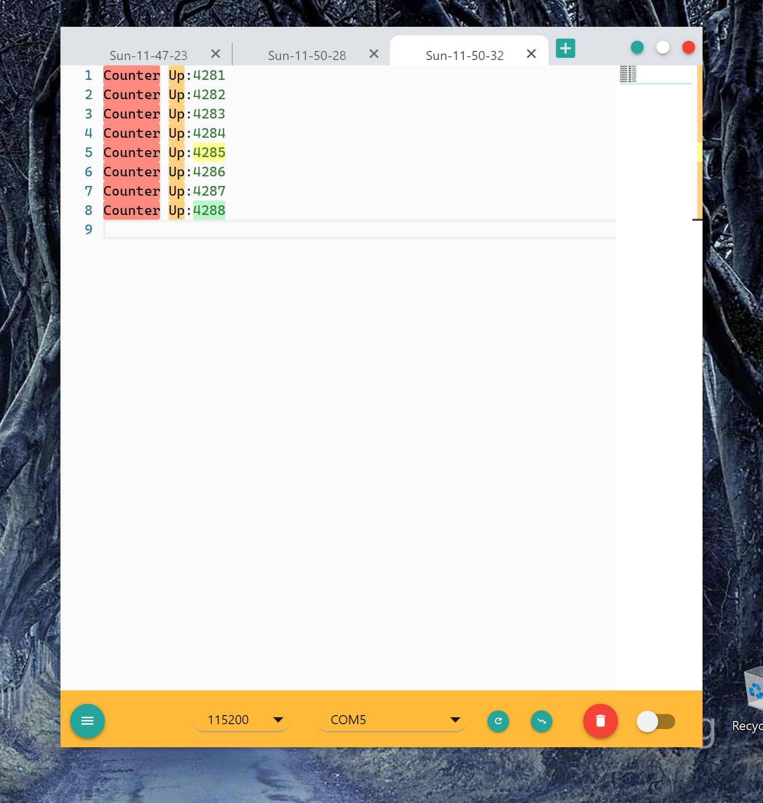

# comNG -- 串口助手

`comNG` 是一款具有现代化 UI 设计并且功能强大的串口助手软件。

`comNG` is a powerful serial port tool with modern UI design. For English users, please refer to [comNG Introduction](doc/Introduction-en.md)

## 文档

请参考 [comNG 完整文档](doc/Introduction.md)

## Todo
- [ ] 发送文件
- [ ] 执行脚本
- [ ] 多窗口
- [ ] 字符模式统一转换不可打印字符
- [ ] 周期性自动枚举可用串口

## 介绍

comNG 区别于其他串口助手的地方在于其强大的 “现场数据分析“ 能力。简单来说就是 comNG 提供的多种功能以帮助用户更方便的分析打印输出文本。这些功能包括：

- 精致的 UI 和交互方式
- 内建的 comNGLang 高亮语法
- 内建的手动文本高亮功能：类似于 notepad++ 的 Style Token
- 搜索文本高亮：类似于 vscode 的搜索文本高亮
- 选择文本高亮：类似于 vscode 的选择文本高亮
- 基于文本内容的中断功能，这是一个全新设计的功能
- 专业的 Hex 模式
- 日志文档的签名：时间和姓名
- 常用命令支持快捷键操作，比如打开/关闭串口、打开/保存文件、清除文本、高亮文本等
- 跨平台：Windows， Mac OS 以及 基于 Debian 的 Linux 系统，比如 Ubuntu 和 Deepin
- 自定义主题（只支持软件下方 Bar 的背景色。。。）
- 一个简单的模拟 Terminal 模式

另外还包含一些串口助手通用的功能：

- Modem 信号指示和控制
- 自定义波特率
- 十六进制接收/发送
- 接收时间戳
- 发送文本
- 流控
- 文件保存和打开，支持拖动
- 抓取至文件

一些不支持的功能，比如：

- 文件发送

## 用户界面




## 使用方法

下载对应系统的安装文件，安装，然后就可以正常使用了。对于 Linux 系统，可能需要对串口设备文件执行以下命令：

`sudo chmod 666 /dev/ttyS1`

记得把 `ttyS1` 替换为你的串口设备文件。

### 快捷键列表

- 打开文件： `CmdOrCtrl + O`
- 用 Hex 模式打开文件： `CmdOrCtrl + Shift + O`
- 保存文件： `CmdOrCtrl + S`
- 打开关闭串口：`CmdOrCtrl + D`
- 打开关闭串口，并且清空 Log：`CmdOrCtrl + Shift + D`
- 清空 Log：`CmdOrCtrl + X`
- 清空所有高亮：`CmdOrCtrl + Shift + X`
- 高亮/去高亮鼠标下方或选择的文本：`CmdOrCtrl + E`

## 开发

### 克隆代码

```
git clone git@gitee.com:xenkuo/comNG.git
```

### 安装依赖文件

请先安装 yarn 和 node-gyp。建议使用以下 `.npmrc` 文件配置：

```
registry=https://registry.npm.taobao.org
electron_mirror=https://cdn.npm.taobao.org/dist/electron/
electron_custom_dir=7.2.4
```

Windows 下安装 node-gyp 比较麻烦，建议多试试。

基础工具安装完成后执行下面的命令：

```
cd comNG
yarn
```

### 运行

```
code .
yarn run start
```

### 编译

```
yarn make
```

## License

comNG is [MIT](./LICENSE) licensed and all it's dependencies are MIT licensed.
