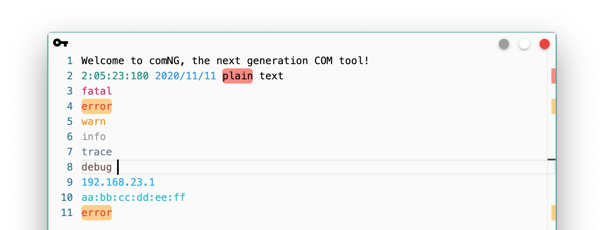

# `comNG` 里的高亮

高亮是 `comNG` 最原始的需求、最重要的功能，也是花费精力最多的地方。

常规的串口日志分析流程是直接发送的串口工具上的，但是只要日志稍微复杂一些，就需要考到其他的文本编辑器里做进一步分析，比如我就经常会考到 notepad++ 里。 在 notepad++ 里，我们可以搜索标记文本、高亮特定文本等等。其实这些功能不算复杂，但是大部分现有的串口工具是没有类似功能的。

于是就有了 `comNG`，而且把高亮推向了更极端的方向。在 `comNG` 里高亮类型有：

- 基于 `comNGLang` 语法的高亮
- 基于 monaco editor 内置的搜索和鼠标点选高亮
- 单独实现的手动文本高亮
- Hex Mode 里鼠标位置的对比高亮
- Hex Mode 里选择文本的对比高亮

最新版的 `comNG` 添加了以 Hex 模式打开文件的功能。这样就可以使用 `comNG` 的 Hex Mode 高亮功能对文件进行简单的十六进制分析。

这里是一些参考图片：

