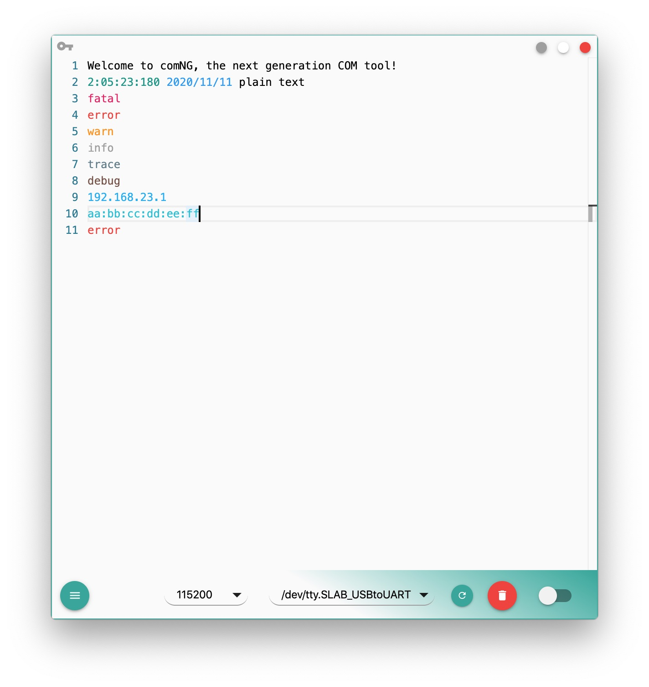
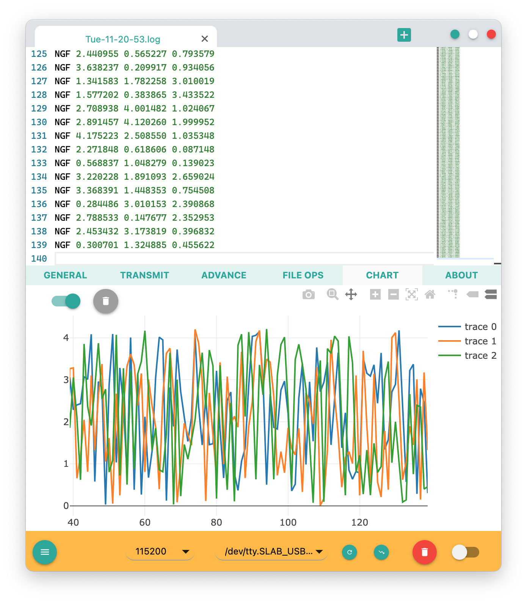
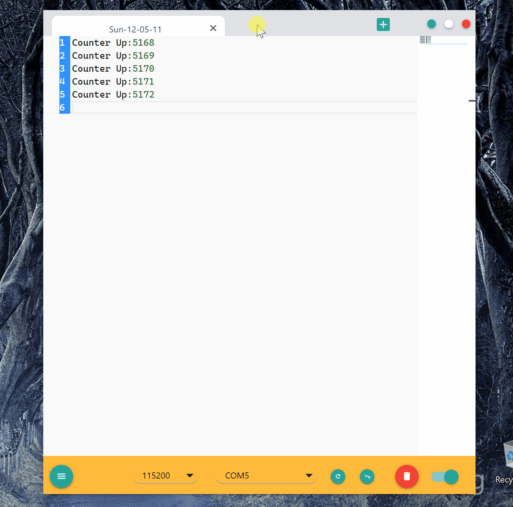
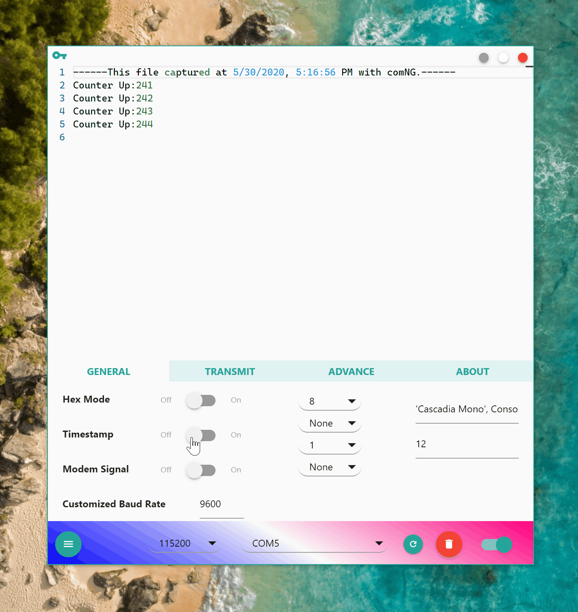

# comNG

A modern and powerful COM tool.

## Doc

For a more detailed doc please refer to: [comNG Introduction](https://xenkuo.github.io/2019-08-01-comNG/)

## Installation

On github or sourceforge, only Windows installer offered as upload installer file is too slow for me. For Mac or Debian installation, you can compile and install from source code or goto [comNG on gitee](https://gitee.com/xenkuo/comNG/releases) to get certain installer, a registration may be needed.

## Introduction

Focus on stable serialport communication and best **on-site data explore**, **comNG** is the Next Generation of COM tool. comNG gives you best experience of on-site log exploring. comNG implemented several features to hit the mark:

- built-in comNGLang syntax
- built-in word highlighter
- multi tabs
- powerful Hex mode
- generic data visualization interface
- globally highlight word you selected (monaco built-in)
- globally highlight word you searched (monaco built-in)
- breakpoint on certain text
- timestamp append and name sign
- cross platform: Windows, Linux and Mac
- a simple simulated terminal mode

Of course it supports common features that other COM tools have:

- baud rate customize
- hex receive and transmit
- flow control
- modem signals indicats and control
- receive timestamp
- text transmit
- file save and open, drag-drop is supported

Features not supported:

- file transmit
- capture to file

## User Interface






## Usage

Download the release package according with you system, install, comNG should work well then.

For Linux user, you may need to add right to COM port before monitor it:

`sudo chmod 666 /dev/ttyS1`

Replace `ttyS1` with your real COM port.

## Development

### Clone Code

```
git clone git@github.com:xenkuo/comNG.git
```

### Install Dependencies

```
cd comNG
yarn
```

You may need to install node native compile tools, if there are problems, `Google` or create issue.

> For Chinese developer, I'd like to advice you use below `.npmrc` file:

```
registry=https://registry.npm.taobao.org
electron_mirror=https://cdn.npm.taobao.org/dist/electron/
electron_custom_dir=7.1.11
```

### Develop

```
code .
yarn start
yarn make
```

## Licence

comNG is [MIT](https://opensource.org/licenses/MIT) licensed and all it's dependencies are MIT licensed.
