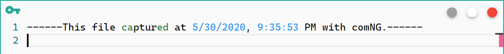
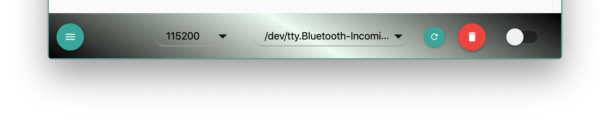

# `comNG` 里其他的高级功能

这里的**高级功能**其实只是一些其他串口助手里没有的或者稍微特殊些的功能，归纳在这里，方便大家查询。

## Modem 信号显示和控制

在 General 标签页内使能 Modem Signal 功能即可，如下图：

其中 CTS、DSR 和 DCD 信号是只读的，每 100 ms 刷新一次；RTS 和 DTR 是可控的。

## 自定义波特率

`comNG` 支持自定义一个波特率：首先在 General 页面的 Customized Baud Rate 输入框里输入需要自定义的波特率，然后在操作面板里选择之前设置的波特率即可。这里自定义的波特率是自动记录的，下次启动 App 时这个波特率还是之前自定义的值。

## 模拟的发送终端模式

在发送页面里，如果 EOF 选项选择了 TERM 模式，则开启模拟 Terminal 模式。这种模式下，换行符是 LF，发送的文本在点击 Enter 键后会发送出去并自动清空。 有些时候这个模式还是挺方便的。

## 签名功能

这个功能在 Advance 页面打开，你还可以配置上你的姓名。该功能开启后，在你点击清空所有日志后，App 会主动在新的日志文件的第一行输入该日志生成的时间和生成人员的名称（如果配置了姓名）。效果如下图：

## 断点功能

这是一个实用性比较强的功能，在 Advance 页面开启。你需要给该功能配置断点文本和断点行数，具体逻辑是：

1. 本次接收到的串口数据里是否包含断点文本
2. 如果包含断点文本，则开始记录收到的换行符
3. 如果收到的换行符等于断点行数，则自动关闭串口，保留该断点文本的上下文。

如果你需要在快速刷新的日志里捕获特定文本，那么这个功能可以给你很多帮助。

## 自定义操作面板颜色

颜值是一个避不开的话题，`comNG` 的所有 UI 设计都是经过像素级考量的。当时在设计 UI 时，其他地方都很满意，唯独操作面板这块找不到感觉。于是这块变成了可配置的。比如下面几种配置，感觉闭着眼都能配出来好颜色：）

OK，差不多这些，希望大家喜欢。
