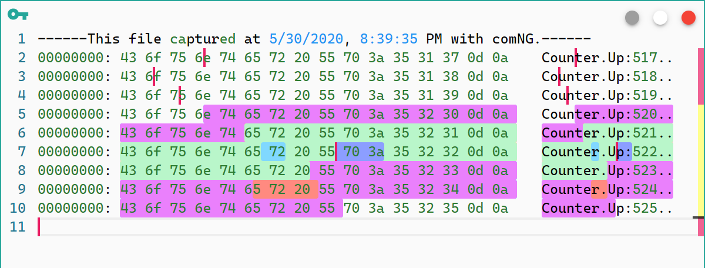

# `comNG` 的快捷键

## 快捷键列表

- 打开文件： `CmdOrCtrl + O`
- 用 Hex 模式打开文件： `CmdOrCtrl + Shift + O`
- 保存文件： `CmdOrCtrl + S`
- 打开关闭串口：`CmdOrCtrl + D`
- 打开关闭串口，并且清空 Log：`CmdOrCtrl + Shift + D`
- 清空 Log：`CmdOrCtrl + X`
- 清空所有高亮：`CmdOrCtrl + Shift + X`
- 高亮/去高亮鼠标下方或选择的文本：`CmdOrCtrl + E`

## 说明

由于 `comNG` 里没有太多的菜单栏，所以很多快捷键在 app 里是没有任何入口的。 为了方便大家检索，另外个别快捷键也需要单独说明下，有必要有一份单独的文档来描述这些快捷键。

## Hex 模式打开文件

要使用这个功能，需要首先在 General 配置里打开 Hex Mode，因为十六进制的展示和高亮都由 Hex Mode 开关的。

## 打开关闭串口并清空 Log

这个快捷键只有在打开串口时会清空 Log，关闭串口时不会清空 Log。

## 清空所有高亮

这里的高亮是指手动高亮，不包含 monaco editor 内置的高亮功能和 `comNGLang` 的语法高亮。

## 高亮/去高亮鼠标下方或选择的文本

高亮没什么要解释的。
去高亮除了可以去除快捷键高亮的文本，还可以去掉 Hex Mode 里鼠标点选高亮的文本。在 Hex Mode 里，鼠标选择特定文本，则 hex 区域和 string 区域的文本都会自动高亮，如下图

图上高亮的文本可以使用此命令删除对应的高亮，因为高亮是有覆盖的，所以文本上可能覆盖有几个高亮，则需要执行几次命令才可以清除所有的高亮。

另外也可以通过清空所有高亮的快捷键一次把所有高亮去除。
